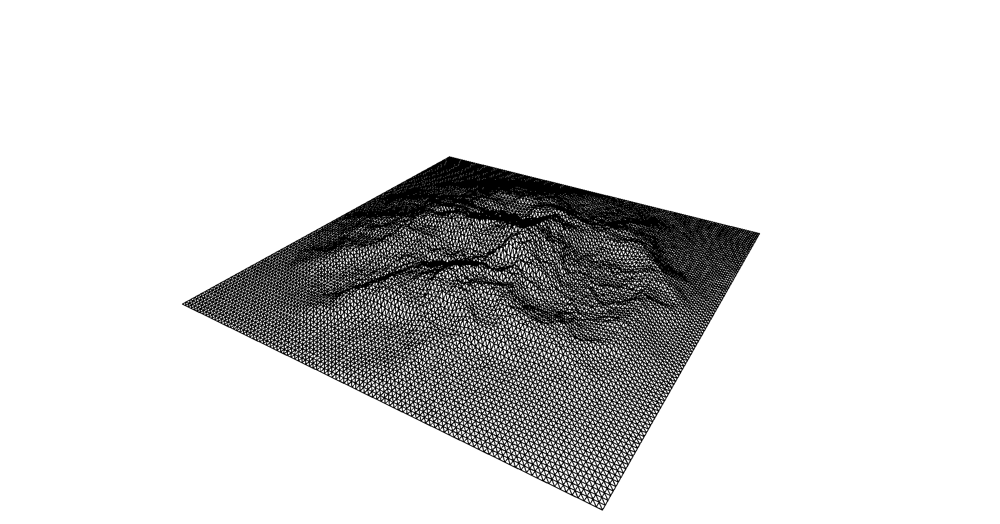
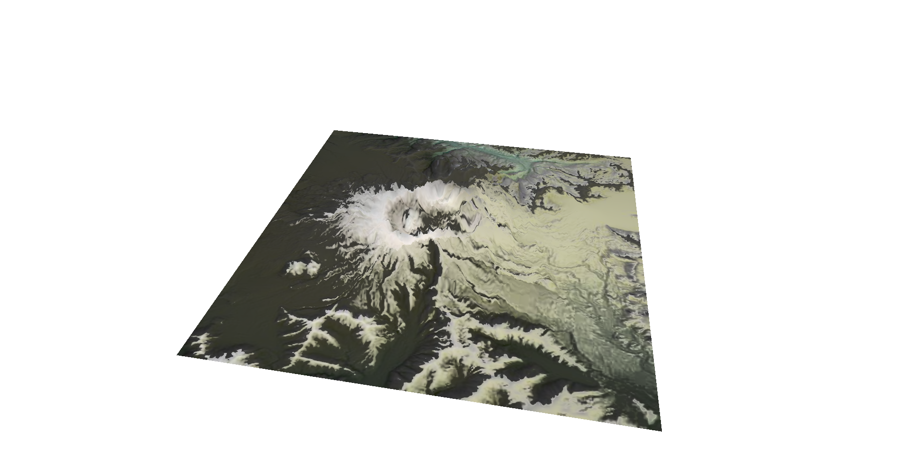

## Render mountain terrain using Perlin Noise

This project implements a 2D Perlin Noise and ridged multifractal function to render mountain terrain.

Graphics are done in c++ and openGL.

Code outputs:
### Triangle Mesh Render

### Texture Render

